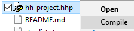

# Contribution Guidelines

# Welcome note
Hi there! Thanks for showing interest to this project which I run since 2011 till present day and I love it. You are welcome to fork this repo, open issues and pull requests, comment, etc.

# Compiling help file
## Step 1: Installing required components

### HTML Help Workshop
This software is required if you would like to compile this repo into `.chm` help file. HTML Help Workshop can be downloaded at https://www.microsoft.com/en-us/download/details.aspx?id=21138.

### Microsoft MSXML
Microsoft MSXML is required for compiling help files from [issrc](https://github.com/jrsoftware/issrc) repository. Download and install `msxml.msi` file at http://www.microsoft.com/en-us/download/details.aspx?id=19662.

### Source code editor
Any of your favorite editors should work. Make sure your code editor works well with different file encodings and can identify them automatically though. All `.htm` files should be only encoded in `windows-1251` so that CHM index and search features work correctly for Russian text.

## Step 2: Compiling the `.chm` help file
You can simply follow instructions in `compile.bat` to compile the project. Other approaches are also described below.

1. Clone this repo into your system: `git clone https://github.com/bugron/ISetupRussianHelp.git` or just [download the zip archive](https://github.com/bugron/ISetupRussianHelp/archive/main.zip) of this repository.
2. After you make sure `HTML Help Workshop` is installed on your system double-click on `hh_project.hhp` to open it in `HTML Help Workshop`
3. `File -> Compile...` to compile source files into a `.chm` file.

Also to make it a bit faster consider saving the following into a `.reg` file (or just create the keys in `regedit`) add adding those keys into registry so you can compile by right clicking on `.hhp` file and selecting `Compile`.

```
Windows Registry Editor Version 5.00

[HKEY_CLASSES_ROOT\hhp.file\shell\compile]
@="Compile"

[HKEY_CLASSES_ROOT\hhp.file\shell\compile\command]
@="\"C:\\Program Files (x86)\\HTML Help Workshop\\hhc.exe\" \"%1\""

```
Do not forget to replace the path to `hhc.exe` if it is different in your case.
The result should looks like this:



# Translation workflow
Check out [translation workflow](docs/TRANSLATION-WORKFLOW.md) document for more information about the translation process.
